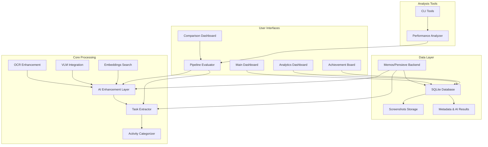

# 🏗️ AutoTaskTracker Architecture Overview

## 📋 System Overview

AutoTaskTracker is an AI-powered application that passively discovers and organizes daily tasks from screenshots. It consists of multiple interconnected components working together.



## 🎯 Main Application Flow

1. **Capture**: Memos captures screenshots automatically
2. **Process**: AI pipelines extract tasks and metadata  
3. **Store**: Results saved to SQLite database
4. **Display**: Multiple dashboards show different views
5. **Analyze**: Comparison tools evaluate AI performance

## 📁 File Structure Relationships

```
AutoTaskTracker/
├── 🎯 MAIN APPLICATION
│   ├── autotasktracker/           # Core application package
│   │   ├── core/                  # → Foundation components
│   │   ├── ai/                    # → AI enhancement features  
│   │   ├── dashboards/            # → User interfaces
│   │   ├── comparison/            # → AI evaluation tools
│   │   └── utils/                 # → Shared utilities
│   │
├── 🔧 TOOLS & SCRIPTS  
│   ├── comparison_cli.py          # → Clean pipeline comparison
│   ├── scripts/                   # → Legacy tools and utilities
│   │   ├── ai_cli.py             # → AI feature management
│   │   ├── generate_embeddings.py # → Batch embedding generation
│   │   └── autotask.py           # → Legacy main script
│   │
├── 📊 CONFIGURATION
│   ├── CLAUDE.md                  # → Mission critical context
│   ├── requirements.txt           # → Python dependencies
│   ├── setup.sh                   # → Initial setup script
│   └── venv/                      # → Virtual environment
│   │
├── 📚 DOCUMENTATION
│   ├── ARCHITECTURE.md            # → This file (system overview)
│   ├── COMPARISON_STRUCTURE.md    # → AI comparison module docs
│   ├── DASHBOARD_LAYOUT.md        # → Dashboard interface guide
│   └── docs/                      # → Detailed documentation
│   │
└── 🧪 TESTING
    ├── tests/                     # → Test suite
    └── examples/                  # → Usage examples
```

## 🔗 Component Relationships

### **Data Flow Architecture**
```
Screenshots → OCR/VLM → Task Extraction → Categorization → Database → Dashboards
     ↓            ↓           ↓              ↓            ↓          ↓
  Memos/       AI Enhancement  Core         Activity    SQLite    Multiple
  Pensieve     Layer          Processing   Categorizer  Storage   Interfaces
```

### **Dependency Graph**
```
Core Components (foundation)
    ↓
AI Enhancement Layer (builds on core)
    ↓  
Comparison Tools (evaluates AI)
    ↓
Dashboards (presents everything)
```

## 📱 Dashboard Ecosystem

### **Production Dashboards** (Daily Use)
- **Main Task Board** (`task_board.py`) → Primary interface for task viewing
- **Analytics** (`analytics.py`) → Productivity insights and trends  
- **Achievement Board** (`achievement_board.py`) → Gamification and goals

### **Development Dashboards** (Analysis)
- **Pipeline Comparison** (`comparison/dashboards/`) → AI method evaluation
- **Legacy Tools** (`dashboards/legacy/`) → Old comparison interfaces

### **Dashboard Relationships**
```
Main Task Board ←── Core Data ──→ Analytics Dashboard
      ↓                               ↓
Achievement Board              Comparison Tools
      ↓                               ↓
  (Daily Use)                  (AI Evaluation)
```

## 🤖 AI Processing Pipeline

### **Processing Stages**
1. **Basic** → Pattern matching on window titles
2. **OCR Enhanced** → + Text extraction and analysis
3. **VLM Enhanced** → + Visual understanding 
4. **Full AI** → + Semantic similarity search

### **AI Component Relationships**
```
autotasktracker/ai/
├── enhanced_task_extractor.py    # → Orchestrates all AI features
├── ocr_enhancement.py           # → Text analysis and confidence
├── vlm_integration.py           # → Visual language model
└── embeddings_search.py         # → Semantic similarity search
```

### **Data Dependencies**
```
Window Title (always available)
    ↓
OCR Text (when available) → OCR Enhancement
    ↓
VLM Description (when available) → VLM Enhancement  
    ↓
Historical Data (when available) → Semantic Search
```

## 📊 Database Schema Relationships

### **Core Tables**
- **entities** → Screenshot files and metadata
- **metadata_entries** → AI processing results linked to entities
- **Key relationships**: `entities.id` ↔ `metadata_entries.entity_id`

### **Metadata Types**
- `ocr_result` → Text extraction results
- `vlm_result` → Visual analysis results  
- `active_window` → Window title information
- `embedding` → Vector embeddings for similarity search

## 🛠️ Development vs Production

### **Production Components** (Always Running)
```
memos serve    (port 8839) → Backend API
task_board.py  (port 8502) → Main dashboard
analytics.py   (port 8503) → Analytics
```

### **Development Components** (As Needed)
```
comparison_cli.py              → CLI analysis tool
pipeline_comparison.py (8512)  → Interactive comparison
achievement_board.py (8507)    → Goals tracking
```

## 🔄 Component Interaction Patterns

### **1. Data Processing Flow**
```
Memos Capture → Database Storage → Core Processing → AI Enhancement → Dashboard Display
```

### **2. User Interaction Flow**  
```
User Views Dashboard → Selects Screenshot → Triggers Processing → Shows Results
```

### **3. Development Flow**
```
Run Comparison → Analyze Results → Tune Parameters → Re-evaluate → Deploy Changes
```

## 📋 Quick Reference Guide

### **Want to see daily tasks?** 
→ http://localhost:8502 (Main Dashboard)

### **Want to analyze productivity?**
→ http://localhost:8503 (Analytics)

### **Want to evaluate AI performance?**
→ `python comparison_cli.py` or http://localhost:8512

### **Want to manage AI features?**
→ `python scripts/ai_cli.py`

### **Want to understand the code?**
→ Start with `autotasktracker/core/` then `autotasktracker/ai/`

This architecture enables clear separation of concerns while maintaining flexibility for AI experimentation and improvement.