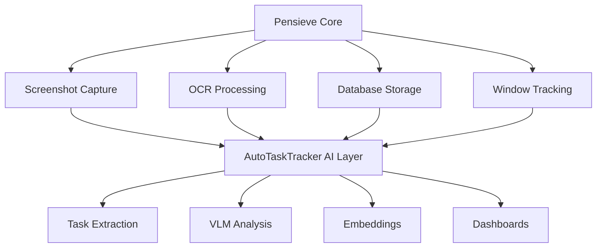

# Pensieve Architecture Integration Guide

## Overview

This document explains how AutoTaskTracker leverages Pensieve (memos) as its foundational infrastructure and how developers should understand and utilize this architecture for optimal system design.

## Table of Contents

1. [Pensieve Core Architecture](#pensieve-core-architecture)
2. [Current Integration Pattern](#current-integration-pattern)
3. [Database Schema Relationship](#database-schema-relationship)
4. [Service Architecture](#service-architecture)
5. [Extension Strategy](#extension-strategy)
6. [Development Guidelines](#development-guidelines)
7. [Performance Considerations](#performance-considerations)
8. [Future Integration Roadmap](#future-integration-roadmap)

---

## Pensieve Core Architecture

### What is Pensieve?

Pensieve (implemented as `memos`) is a privacy-first screenshot capture and OCR system that:
- Captures screenshots continuously (default: 4-second intervals)
- Performs OCR using Tesseract for text extraction
- Stores everything locally in SQLite database
- Provides window activity tracking
- Offers REST API for data access

### Why AutoTaskTracker is Built on Pensieve

**Strategic Decision**: AutoTaskTracker leverages Pensieve rather than building screenshot capture from scratch because:

1. **Privacy-First Design**: All data stays local, no cloud dependencies
2. **Proven OCR Pipeline**: Tesseract integration already optimized and tested
3. **Robust Storage**: SQLite database with extensible metadata architecture
4. **Background Service**: Handles continuous capture without user intervention
5. **Cross-Platform**: Works on macOS, Linux, and Windows
6. **Open Source**: Full control over data capture and processing



---

## Current Integration Pattern

### Layer Architecture

AutoTaskTracker implements a **layered architecture** on top of Pensieve:

```
┌─────────────────────────────────────────────────────────────┐
│                    Streamlit Dashboards                     │
│         (Task Board, Analytics, Time Tracker)              │
└─────────────────────────────────────────────────────────────┘
┌─────────────────────────────────────────────────────────────┐
│                AutoTaskTracker AI Layer                    │
│    (Task Extraction, VLM, Embeddings, Categorization)     │
└─────────────────────────────────────────────────────────────┘
┌─────────────────────────────────────────────────────────────┐
│                    Pensieve Foundation                     │
│        (Screenshot Capture, OCR, Database, API)           │
└─────────────────────────────────────────────────────────────┘
```

### Integration Points

**1. Database Layer** (`autotasktracker/core/database.py`):
```python
class DatabaseManager:
    def __init__(self, db_path: Optional[str] = None):
        # Direct connection to Pensieve's SQLite database
        self.db_path = db_path or "~/.memos/database.db"
        
    def fetch_tasks(self, start_date=None, end_date=None):
        # Query Pensieve's entities and metadata_entries tables
        query = """
        SELECT 
            e.id,
            e.filepath,
            datetime(e.created_at, 'localtime') as created_at,
            me.value as ocr_text,
            me2.value as active_window
        FROM entities e
        LEFT JOIN metadata_entries me ON e.id = me.entity_id 
            AND me.key = 'ocr_result'
        LEFT JOIN metadata_entries me2 ON e.id = me2.entity_id 
            AND me2.key = 'active_window'
        WHERE e.file_type_group = 'image'
        """
```

**2. Configuration Integration** (`autotasktracker/config.py`):
```python
# AutoTaskTracker uses Pensieve's default paths
DEFAULT_DB_PATH = "~/.memos/database.db"
DEFAULT_MEMOS_DIR = "~/.memos"
DEFAULT_SCREENSHOTS_DIR = "~/.memos/screenshots"
MEMOS_PORT = 8839  # Pensieve REST API port
```

**3. Service Management** (`scripts/` directory):
```bash
# AutoTaskTracker relies on Pensieve daemon
memos start    # Start screenshot capture
memos stop     # Stop screenshot capture
memos ps       # Check service status
```

---

## Database Schema Relationship

### Pensieve Core Tables

**entities** - Screenshot metadata:
```sql
CREATE TABLE entities (
    id INTEGER PRIMARY KEY,
    filepath TEXT NOT NULL,      -- Screenshot file path
    filename TEXT NOT NULL,      -- Screenshot filename
    created_at TIMESTAMP,        -- When screenshot was taken
    file_type_group TEXT,        -- Always 'image' for screenshots
    last_scan_at TIMESTAMP       -- Last processing time
);
```

**metadata_entries** - Extensible key-value store:
```sql
CREATE TABLE metadata_entries (
    entity_id INTEGER,           -- Foreign key to entities.id
    key TEXT,                    -- Metadata type identifier
    value TEXT,                  -- The actual data (text/JSON/binary)
    created_at TIMESTAMP,        -- When metadata was added
    FOREIGN KEY (entity_id) REFERENCES entities(id)
);
```

### AutoTaskTracker Extensions

AutoTaskTracker extends Pensieve's metadata schema with additional keys:

**Pensieve Native Metadata**:
- `ocr_result`: OCR text from Tesseract
- `active_window`: Window title and application info

**AutoTaskTracker AI Metadata**:
- `vlm_result`: Visual language model analysis
- `vlm_structured`: Structured VLM output with UI elements
- `embedding`: Vector embeddings for semantic search
- `tasks`: Extracted task descriptions
- `category`: Activity categorization
- `minicpm_v_result`: Specific VLM model results

### Example Data Flow

```python
# 1. Pensieve captures screenshot and performs OCR
# Automatically creates:
entities: id=123, filepath="screenshot_001.png", created_at="2025-07-04 10:30:00"
metadata_entries: entity_id=123, key="ocr_result", value="def calculate_total():"
metadata_entries: entity_id=123, key="active_window", value="VS Code - main.py"

# 2. AutoTaskTracker processes the data
# Adds AI metadata:
metadata_entries: entity_id=123, key="tasks", value="Writing calculate_total function"
metadata_entries: entity_id=123, key="category", value="🧑‍💻 Coding"
metadata_entries: entity_id=123, key="vlm_result", value="User is coding in Python"
metadata_entries: entity_id=123, key="embedding", value="[0.1, 0.3, -0.2, ...]"
```

---

## Service Architecture

### Process Hierarchy

```
┌─────────────────────────────────────────────────────────────┐
│                   User Interface Layer                     │
│                                                             │
│  Task Board (8502)  Analytics (8503)  Time Tracker (8505)  │
└─────────────────────────────────────────────────────────────┘
                                │
                                ▼
┌─────────────────────────────────────────────────────────────┐
│                AutoTaskTracker Processes                   │
│                                                             │
│    AI Processing    VLM Service    Embedding Generation    │
└─────────────────────────────────────────────────────────────┘
                                │
                                ▼
┌─────────────────────────────────────────────────────────────┐
│                   Pensieve Foundation                      │
│                                                             │
│    memos daemon     REST API (8839)     SQLite Database    │
└─────────────────────────────────────────────────────────────┘
```

### Service Dependencies

**Critical Path**: Pensieve daemon must be running for AutoTaskTracker to function:

```bash
# Check Pensieve status
memos ps
# Expected output: "Screenshot capture is running"

# If not running:
memos start

# Verify database accessibility
sqlite3 ~/.memos/database.db "SELECT COUNT(*) FROM entities;"
```

**Port Allocation**:
- `8839`: Pensieve REST API (reserved, not currently used)
- `8502`: Task Board Dashboard
- `8503`: Analytics Dashboard  
- `8505`: Time Tracker Dashboard

---

## Extension Strategy

### Non-Invasive Extension Pattern

AutoTaskTracker follows a **non-invasive extension pattern** that:
- Never modifies Pensieve's core functionality
- Uses existing metadata_entries table for AI results
- Maintains compatibility with Pensieve updates
- Allows AutoTaskTracker to be disabled without breaking Pensieve

### AI Processing Pipeline

```python
# autotasktracker/core/task_extractor.py
class TaskExtractor:
    def process_entity(self, entity_id: int):
        # 1. Read Pensieve data
        ocr_text = self.db.get_metadata(entity_id, 'ocr_result')
        window_title = self.db.get_metadata(entity_id, 'active_window')
        
        # 2. Extract task information
        task_info = self._extract_task(window_title, ocr_text)
        
        # 3. Store AI results back to Pensieve schema
        self.db.store_metadata(entity_id, 'tasks', task_info['task'])
        self.db.store_metadata(entity_id, 'category', task_info['category'])
        
        # 4. Optional: Add VLM analysis
        if self.vlm_enabled:
            vlm_result = self._analyze_with_vlm(entity_id)
            self.db.store_metadata(entity_id, 'vlm_result', vlm_result)
```

### Graceful Degradation

AutoTaskTracker implements **graceful degradation** at each layer:

1. **Basic Mode**: Uses only window titles (always available)
2. **OCR Enhanced**: Adds OCR text analysis (requires Tesseract)
3. **VLM Enhanced**: Adds visual understanding (requires Ollama)
4. **Full AI**: Adds semantic search (requires embeddings)

```python
# Example degradation logic
def extract_task(self, entity_id: int) -> Dict:
    # Always available: window title
    window_title = self.db.get_metadata(entity_id, 'active_window')
    task_info = self._extract_from_window_title(window_title)
    
    # OCR enhancement (if available)
    ocr_text = self.db.get_metadata(entity_id, 'ocr_result')
    if ocr_text and task_info.get('confidence', 0) < 0.8:
        task_info = self._enhance_with_ocr(task_info, ocr_text)
    
    # VLM enhancement (if available)
    if self.vlm_enabled and task_info.get('confidence', 0) < 0.9:
        vlm_result = self._analyze_with_vlm(entity_id)
        task_info = self._enhance_with_vlm(task_info, vlm_result)
    
    return task_info
```

---

## Development Guidelines

### Working with Pensieve Integration

**1. Always Use DatabaseManager**:
```python
# ✅ CORRECT
from autotasktracker.core.database import DatabaseManager
db = DatabaseManager()  # Uses Pensieve database automatically

# ❌ WRONG
import sqlite3
conn = sqlite3.connect("~/.memos/database.db")  # Direct connection
```

**2. Respect Pensieve Schema**:
```python
# ✅ CORRECT - Use metadata_entries for AI data
db.store_metadata(entity_id, 'vlm_result', json.dumps(vlm_data))

# ❌ WRONG - Don't modify Pensieve core tables
db.execute("ALTER TABLE entities ADD COLUMN ai_result TEXT")
```

**3. Environment Setup**:
```bash
# ✅ CORRECT - Use virtual environment
./venv/bin/python -m memos.commands ps

# ❌ WRONG - Global Python may have conflicts
python -m memos.commands ps
```

**4. Error Handling**:
```python
def process_with_pensieve_fallback(self, entity_id: int):
    try:
        # Try AI processing
        return self._ai_process(entity_id)
    except Exception as e:
        # Fallback to Pensieve native data
        logger.warning(f"AI processing failed: {e}")
        return self._basic_process(entity_id)
```

### Testing Guidelines

**1. Mock Pensieve for Unit Tests**:
```python
@pytest.fixture
def mock_pensieve_db():
    with patch('autotasktracker.core.database.DatabaseManager') as mock:
        mock.return_value.fetch_tasks.return_value = pd.DataFrame({
            'id': [1, 2, 3],
            'ocr_text': ['def main():', 'class MyClass:', 'import pandas'],
            'active_window': ['VS Code', 'PyCharm', 'Terminal']
        })
        yield mock
```

**2. Integration Tests with Real Pensieve**:
```python
def test_pensieve_integration():
    # Requires actual Pensieve database
    db = DatabaseManager()
    assert db.test_connection()
    
    # Test that our extensions don't break Pensieve
    entities = db.fetch_tasks(limit=1)
    assert not entities.empty
```

---

## Performance Considerations

### Database Query Optimization

**1. Use Efficient Joins**:
```python
# ✅ OPTIMIZED - Single query with LEFT JOINs
query = """
SELECT 
    e.id,
    e.created_at,
    me1.value as ocr_text,
    me2.value as active_window,
    me3.value as vlm_result,
    me4.value as tasks
FROM entities e
LEFT JOIN metadata_entries me1 ON e.id = me1.entity_id AND me1.key = 'ocr_result'
LEFT JOIN metadata_entries me2 ON e.id = me2.entity_id AND me2.key = 'active_window'
LEFT JOIN metadata_entries me3 ON e.id = me3.entity_id AND me3.key = 'vlm_result'
LEFT JOIN metadata_entries me4 ON e.id = me4.entity_id AND me4.key = 'tasks'
WHERE e.created_at > ?
ORDER BY e.created_at DESC
LIMIT ?
"""

# ❌ INEFFICIENT - Multiple queries
for entity in entities:
    ocr_text = db.get_metadata(entity.id, 'ocr_result')
    window_title = db.get_metadata(entity.id, 'active_window')
    # ... multiple database hits
```

**2. Batch Processing**:
```python
def process_batch(self, entity_ids: List[int]):
    # Process multiple entities in single transaction
    with self.db.get_connection() as conn:
        for entity_id in entity_ids:
            task_info = self._extract_task(entity_id)
            self.db.store_metadata(entity_id, 'tasks', task_info, conn=conn)
```

### Memory Management

**1. Streaming Large Datasets**:
```python
def process_large_dataset(self, date_range: Tuple[datetime, datetime]):
    # Process in chunks to avoid memory issues
    chunk_size = 1000
    offset = 0
    
    while True:
        entities = self.db.fetch_tasks(
            start_date=date_range[0],
            end_date=date_range[1],
            limit=chunk_size,
            offset=offset
        )
        
        if entities.empty:
            break
            
        self._process_chunk(entities)
        offset += chunk_size
```

**2. Cache AI Results**:
```python
@lru_cache(maxsize=1000)
def get_embeddings(self, text: str) -> np.ndarray:
    # Cache expensive AI computations
    return self.embedding_model.encode(text)
```

---

## Future Integration Roadmap

### Phase 1: Enhanced Database Integration

**Current**: Direct SQLite access  
**Future**: Use Pensieve's REST API for better abstraction

```python
# Future implementation
import requests

class PensieveClient:
    def __init__(self, base_url="http://localhost:8839"):
        self.base_url = base_url
    
    def get_screenshots(self, start_date, end_date):
        response = requests.get(f"{self.base_url}/api/screenshots", 
                              params={"start": start_date, "end": end_date})
        return response.json()
    
    def add_metadata(self, entity_id, key, value):
        requests.post(f"{self.base_url}/api/metadata", 
                     json={"entity_id": entity_id, "key": key, "value": value})
```

### Phase 2: Plugin Architecture

**Current**: External AI processing  
**Future**: AutoTaskTracker as Pensieve plugin

```python
# Future plugin implementation
class AutoTaskTrackerPlugin:
    def __init__(self, pensieve_instance):
        self.pensieve = pensieve_instance
        self.pensieve.register_processor('ai_task_extraction', self.process)
    
    def process(self, entity):
        # Process within Pensieve's lifecycle
        task_info = self.extract_task(entity)
        return {"tasks": task_info}
```

### Phase 3: Advanced Features

**Planned Integrations**:
1. **pgvector support**: For advanced semantic search
2. **Configuration sync**: Share settings between Pensieve and AutoTaskTracker
3. **Processing hooks**: Real-time AI processing as screenshots are captured
4. **Advanced API**: Expose AutoTaskTracker features via Pensieve's REST API

---

## Conclusion

AutoTaskTracker's architecture leverages Pensieve as a robust foundation while maintaining clear separation of concerns. This design enables:

- **Privacy-first operation**: All data remains local
- **Graceful degradation**: Core functionality works even if AI features fail
- **Non-invasive extension**: Pensieve can be updated without breaking AutoTaskTracker
- **Performance optimization**: Direct database access with intelligent caching
- **Future scalability**: Clear path to deeper integration as both systems evolve

Developers working on AutoTaskTracker should understand this foundation and build upon it rather than around it, ensuring the system remains maintainable and extensible as both projects continue to develop.

---

## Quick Reference

### Key Files
- `autotasktracker/core/database.py` - Pensieve database integration
- `autotasktracker/config.py` - Configuration management
- `scripts/` - Service management utilities
- `CLAUDE.md` - Setup and troubleshooting guide

### Essential Commands
```bash
# Check Pensieve status
memos ps

# Start/stop Pensieve
memos start
memos stop

# Check AutoTaskTracker connection
python -c "from autotasktracker.core.database import DatabaseManager; print(DatabaseManager().test_connection())"

# View live data
sqlite3 ~/.memos/database.db "SELECT COUNT(*) FROM entities;"
```

### Support Resources
- [Pensieve Documentation](https://github.com/ruslanmv/pensieve)
- [AutoTaskTracker Architecture](./ARCHITECTURE.md)
- [Development Setup](../guides/README_AI.md)