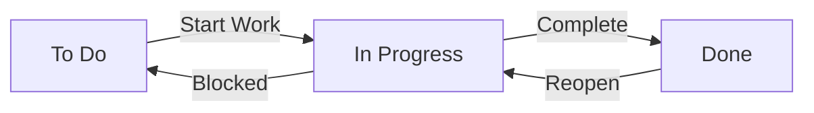

# Task Status Workflow (To Do / In Progress / Done)

## 1. Overview

### 1.1 Conceptual Definition
The Task Status Workflow is a core component of AutoTaskTracker that manages the lifecycle of tasks through three primary states: **To Do**, **In Progress**, and **Done**. This Kanban-inspired workflow provides a clear visual representation of task progress and helps users manage their work efficiently.

### 1.2 Purpose
- Provide a simple, intuitive way to track task progress
- Enable quick status updates with minimal effort
- Support work-in-progress (WIP) limits for better focus
- Offer visual indicators of workflow bottlenecks
- Facilitate team collaboration through shared task status

## 2. Technical Specifications

### 2.1 Component Architecture
```
┌───────────────────────────────────────────────────────────────┐
│                    Task Status Workflow                       │
├───────────────┬───────────────────┬─────────────────────────┤
│    TO DO      │    IN PROGRESS    │          DONE           │
│  ┌─────────┐  │  ┌─────────────┐  │  ┌───────────────────┐  │
│  │ Task 1  │  │  │   Task 2    │  │  │      Task 3      │  │
│  ├─────────┤  │  ├─────────────┤  │  ├───────────────────┤  │
│  │ Task 4  │  │  │   Task 5    │  │  │      Task 6      │  │
│  └─────────┘  │  └─────────────┘  │  └───────────────────┘  │
│  (3)          │  (2)              │  (5)                    │
└───────────────┴───────────────────┴─────────────────────────┘
```

### 2.2 Data Model

#### 2.2.1 Status Definitions
- **To Do**: Task is defined but work has not started
- **In Progress**: Actively being worked on
- **Done**: Completed and verified

#### 2.2.2 Data Structure
```python
class TaskStatus(Enum):
    TODO = "to_do"
    IN_PROGRESS = "in_progress"
    DONE = "done"

class Task:
    id: UUID
    title: str
    description: str
    status: TaskStatus
    created_at: datetime
    started_at: Optional[datetime]
    completed_at: Optional[datetime]
    priority: int
    assignee: Optional[UUID]  # User ID
    metadata: Dict[str, Any]
```

## 3. Component Details

### 3.1 Status Transitions

#### 3.1.1 Valid State Changes


#### 3.1.2 Transition Rules
- **To Do → In Progress**:
  - Sets `started_at` timestamp
  - May trigger notifications
  - Updates assignee if not set
  
- **In Progress → Done**:
  - Sets `completed_at` timestamp
  - Calculates time spent
  - Triggers completion hooks
  
- **Done → In Progress**:
  - Preserves original timestamps
  - Adds a new activity log entry
  - May require reason for reopening

### 3.2 Visual Components

#### 3.2.1 Status Cards
- **To Do (Blue)**
  - Icon: 📋
  - Shows unstarted tasks
  - Sorted by priority/creation
  
- **In Progress (Yellow)**
  - Icon: 🔄
  - Shows active tasks
  - Optional WIP limits
  - Time elapsed indicator
  
- **Done (Green)**
  - Icon: ✅
  - Shows completed tasks
  - Grouped by completion date
  - Optional auto-archive

#### 3.2.2 Task Card Elements
```
┌───────────────────────────────┐
│  [P1] Implement User Auth    │
├───────────────────────────────┤
│  🕒 Started: 2h ago          │
│  👤 Assigned: @dev1         │
│  📅 Due: Today              │
│  ⏱️ Time Spent: 1h 45m      │
│  🏷️ Tags: backend, security │
└───────────────────────────────┘
```

## 4. Implementation

### 4.1 Status Management

#### 4.1.1 Update Status
```python
def update_task_status(task_id: UUID, new_status: TaskStatus, user_id: UUID) -> Task:
    """Update a task's status with validation and logging."""
    with DatabaseManager() as db:
        # Get current task state
        task = db.get_task(task_id)
        
        # Validate transition
        if not is_valid_transition(task.status, new_status):
            raise InvalidStatusTransition(
                f"Cannot change status from {task.status} to {new_status}"
            )
        
        # Update timestamps
        updates = {"status": new_status, "updated_at": datetime.utcnow()}
        
        if new_status == TaskStatus.IN_PROGRESS and not task.started_at:
            updates["started_at"] = datetime.utcnow()
        elif new_status == TaskStatus.DONE and not task.completed_at:
            updates["completed_at"] = datetime.utcnow()
        
        # Apply updates
        db.update_task(task_id, updates)
        
        # Log the status change
        log_activity(
            user_id=user_id,
            action="status_change",
            task_id=task_id,
            details={"from": task.status, "to": new_status}
        )
        
        return db.get_task(task_id)
```

### 4.2 Work-in-Progress (WIP) Limits

#### 4.2.1 WIP Enforcement
```python
def check_wip_limit(user_id: UUID) -> bool:
    """Check if user has reached their WIP limit."""
    current_wip = get_in_progress_count(user_id)
    wip_limit = get_user_wip_limit(user_id)
    return current_wip < wip_limit

class WipLimitExceeded(Exception):
    """Raised when user tries to exceed their WIP limit."""
    pass

def start_task(task_id: UUID, user_id: UUID) -> None:
    """Start working on a task with WIP limit enforcement."""
    if not check_wip_limit(user_id):
        raise WipLimitExceeded(
            f"You've reached your WIP limit of {get_user_wip_limit(user_id)} tasks"
        )
    update_task_status(task_id, TaskStatus.IN_PROGRESS, user_id)
```

## 5. User Experience

### 5.1 Drag and Drop Interface
- Intuitive drag-and-drop between status columns
- Visual feedback during drag operations
- Snappy animations for smooth transitions
- Touch device support

### 5.2 Keyboard Shortcuts
- `→`: Move task right (next status)
- `←`: Move task left (previous status)
- `Space`: Toggle task selection
- `Enter`: Open task details

## 6. Performance Considerations

### 6.1 Optimistic Updates
- Immediate UI feedback
- Background sync with server
- Conflict resolution

### 6.2 Batch Operations
- Bulk status updates
- Multi-select support
- Background processing for large updates

## 7. Related Components

### 7.1 Integration Points
- Task List View
- User Assignment System
- Activity Feed
- Notification System
- Time Tracking

### 7.2 Dependencies
- State Management
- API Client
- Local Storage
- Event Bus

## 8. Future Enhancements

### 8.1 Planned Features
- Custom status workflows
- Status-specific fields
- Advanced transition rules
- Workflow automation

### 8.2 Research Areas
- Predictive status changes
- AI-assisted task prioritization
- Automated status updates based on activity
