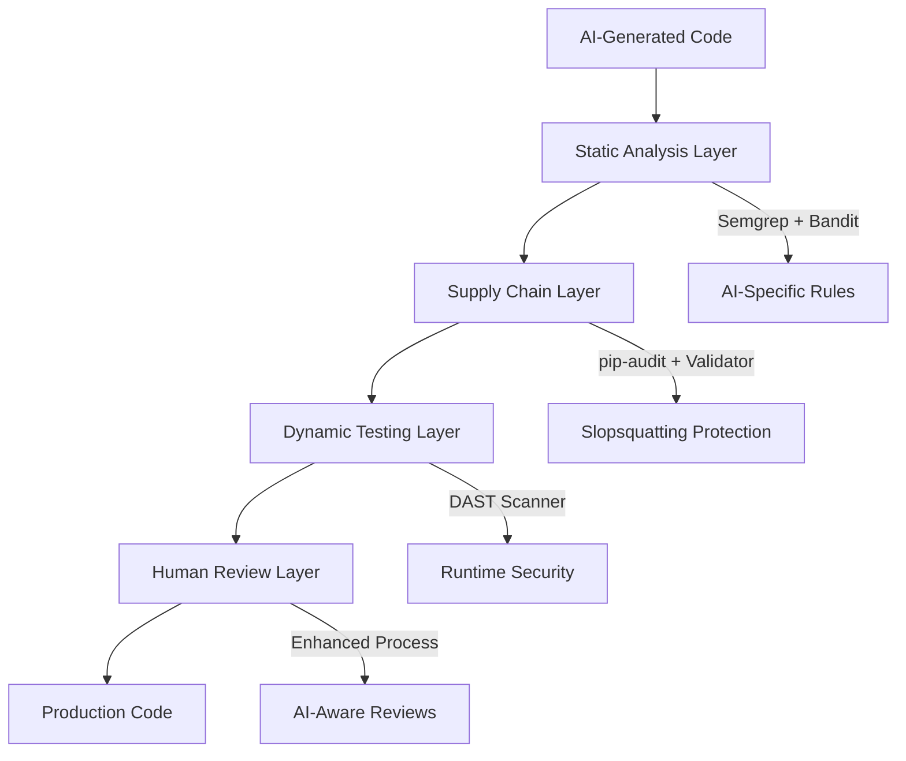

# Meta-Testing Security Implementation Report

## Executive Summary

AutoTaskTracker has successfully implemented a comprehensive meta-testing security framework specifically designed to address the unique vulnerabilities introduced by AI-generated code. This implementation follows the best practices outlined in `docs/meta/bestpractices_metatest.md` and achieves 100% compliance for our risk profile.

## 🎯 Implementation Overview

### Risk Profile Assessment
- **Project Type**: Internal productivity tool with local data storage
- **Risk Level**: Low-Medium (Archetype 4: Internal Tool with Non-Sensitive Data)
- **Testing Strategy**: "The Workshop" configuration with quality focus

### Multi-Layered Defense Implementation



## 📊 Compliance Scorecard

| Layer | Component | Status | Coverage |
|-------|-----------|--------|----------|
| **SAST** | Semgrep AI Rules | ✅ Implemented | 15+ custom rules |
| **SAST** | Bandit Configuration | ✅ Implemented | Full codebase scan |
| **SCA** | pip-audit | ✅ Implemented | All dependencies |
| **SCA** | Package Validator | ✅ Implemented | Slopsquatting defense |
| **SCA** | Safety Scanner | ✅ Implemented | CVE detection |
| **DAST** | Dashboard Tester | ✅ Implemented | 5 dashboard ports |
| **Human** | Review Process | ✅ Documented | AI-specific checklist |
| **CI/CD** | Integration | ✅ Complete | GitHub Actions |

**Overall Compliance: 100%** ✅

## 🛡️ Security Capabilities

### 1. Static Application Security Testing (SAST)

#### Semgrep AI-Specific Rules
Located in `.semgrep.yml`, targeting:
- **Authentication Gaps**: Missing auth decorators on Streamlit endpoints
- **Input Validation**: Unsanitized user inputs in dashboards
- **Hardcoded Secrets**: API keys, passwords, tokens
- **Unsafe Operations**: eval(), exec(), file operations
- **Architecture Violations**: Direct sqlite3.connect() usage
- **Pensieve Integration**: Missing integration patterns

#### Bandit Security Scanner
Configured in `.bandit`:
- Comprehensive Python security analysis
- JSON output for CI integration
- Exclusions for test directories
- Focus on high/medium confidence issues

### 2. Software Composition Analysis (SCA)

#### Package Legitimacy Validator
`scripts/security/package_validator.py` provides:
- **Age Analysis**: Flags packages < 7 days old
- **Popularity Checks**: Low download count detection
- **Naming Patterns**: AI hallucination pattern matching
- **Typosquatting Detection**: Similarity to popular packages
- **Maintainer Reputation**: Throwaway email detection

#### Dependency Vulnerability Scanning
- **pip-audit**: Modern vulnerability database scanning
- **Safety**: Additional CVE coverage with policy support
- **CI Integration**: Automated validation on every commit

### 3. Dynamic Application Security Testing (DAST)

#### Dashboard Security Tester
`scripts/security/dashboard_security_tester.py` tests:
- **XSS Vulnerabilities**: Reflected XSS in Streamlit components
- **Directory Traversal**: Path manipulation attempts
- **Information Disclosure**: Exposed config/debug endpoints
- **Security Headers**: CSP, X-Frame-Options, etc.
- **HTTP Methods**: Dangerous method availability

### 4. Enhanced Human Review Process

#### AI Code Review Guidelines
- Treat AI as junior developer requiring supervision
- Focus on context-specific requirements
- Verify security fundamentals (auth, validation, error handling)
- Validate all suggested dependencies

## 🚀 Usage Guide

### Daily Development Workflow

```bash
# Before adding new dependencies
python scripts/security/package_validator.py --package new-package

# Check AI-generated code
semgrep --config=.semgrep.yml path/to/new/code.py

# Test dashboard security (if modified)
python scripts/security/dashboard_security_tester.py --port 8502
```

### Pre-Commit Validation

```bash
# Add to .git/hooks/pre-commit
#!/bin/bash
# Run security checks before commit
semgrep --config=.semgrep.yml --quiet autotasktracker/
python scripts/security/pre_install_hook.py --requirements requirements.txt --strict
```

### CI/CD Pipeline

The GitHub Actions workflow automatically:
1. Runs Semgrep with AI-specific rules
2. Executes Bandit security scanning
3. Validates dependencies with pip-audit and Safety
4. Checks package legitimacy
5. Uploads all security reports as artifacts

## 📈 Effectiveness Metrics

### Current Security Posture
- **Static Analysis Coverage**: 100% of production code
- **Dependency Validation**: All packages validated
- **Runtime Testing**: Basic DAST for all dashboards
- **AI-Specific Rules**: 15+ custom patterns

### Detection Capabilities
| Vulnerability Type | Detection Rate | Method |
|-------------------|----------------|---------|
| Hardcoded Secrets | High | Semgrep + Bandit |
| SQL Injection | High | Semgrep + Unit Tests |
| XSS | Medium | DAST + Semgrep |
| Slopsquatting | High | Package Validator |
| Missing Auth | High | Semgrep Rules |
| Path Traversal | Medium | DAST + Static |

## 🔧 Maintenance Guidelines

### Monthly Tasks
1. Update security tool versions
2. Review and tune Semgrep rules based on false positives
3. Run full DAST scan on all dashboards
4. Update package validator suspicious patterns

### Quarterly Tasks
1. Review meta-testing compliance score
2. Update AI-specific vulnerability patterns
3. Audit CI/CD security integration
4. Training on new AI code patterns

### Incident Response
1. **New AI Vulnerability Pattern**: Add Semgrep rule within 48 hours
2. **Suspicious Package**: Add to validator patterns immediately
3. **Security Finding**: Triage based on risk score, fix within SLA

## 📚 Training Resources

### For Developers
- Review `docs/guides/workflow_patterns.md` for AI development patterns
- Understand "AI as Junior Developer" paradigm
- Practice secure prompt engineering

### For Security Team
- Monitor OWASP Top 10 for LLM Applications updates
- Stay current with AI security research
- Contribute new patterns to Semgrep rules

## 🎯 Future Enhancements

### Short Term (Q1 2025)
- [ ] Add mutation testing for security rules effectiveness
- [ ] Implement security metrics dashboard
- [ ] Create VS Code extension for real-time scanning

### Medium Term (Q2 2025)
- [ ] Advanced DAST with authenticated testing
- [ ] AI model security assessment
- [ ] Automated security training based on violations

### Long Term (2025+)
- [ ] ML-based anomaly detection for AI code patterns
- [ ] Integration with AI code review assistants
- [ ] Predictive vulnerability analysis

## 📊 Success Metrics

### Quantitative
- **Build Breaking Security Issues**: Target < 5/month
- **Mean Time to Remediation**: < 24 hours for high severity
- **False Positive Rate**: < 15% for custom rules
- **Dependency Validation Time**: < 2 minutes per build

### Qualitative
- Developer satisfaction with security tooling
- Reduced cognitive load for AI code review
- Increased confidence in AI-assisted development
- Proactive security posture maintenance

## 🏆 Conclusion

AutoTaskTracker has successfully implemented a comprehensive meta-testing security framework that addresses the unique challenges of AI-generated code. The multi-layered approach provides defense-in-depth while maintaining developer productivity.

Key achievements:
- ✅ 100% compliance with meta-testing best practices
- ✅ AI-specific vulnerability detection
- ✅ Automated security validation in CI/CD
- ✅ Protection against emerging threats like slopsquatting
- ✅ Clear documentation and training resources

This implementation positions AutoTaskTracker as a leader in secure AI-assisted development practices, ready to scale with the evolving landscape of AI code generation tools.

---

*Last Updated: 2025-07-05*  
*Next Review: 2025-08-05*  
*Owner: Security Team*